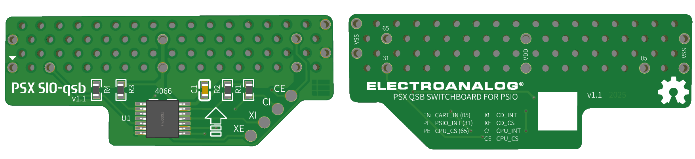
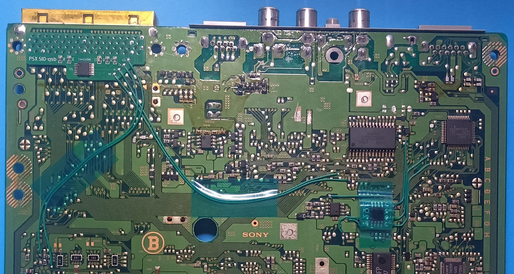
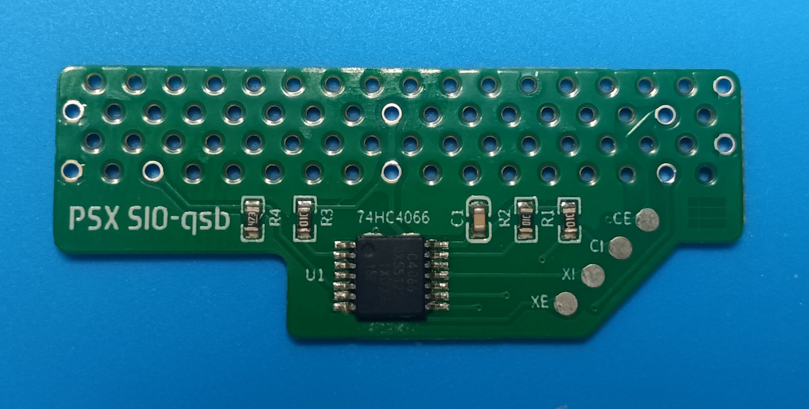
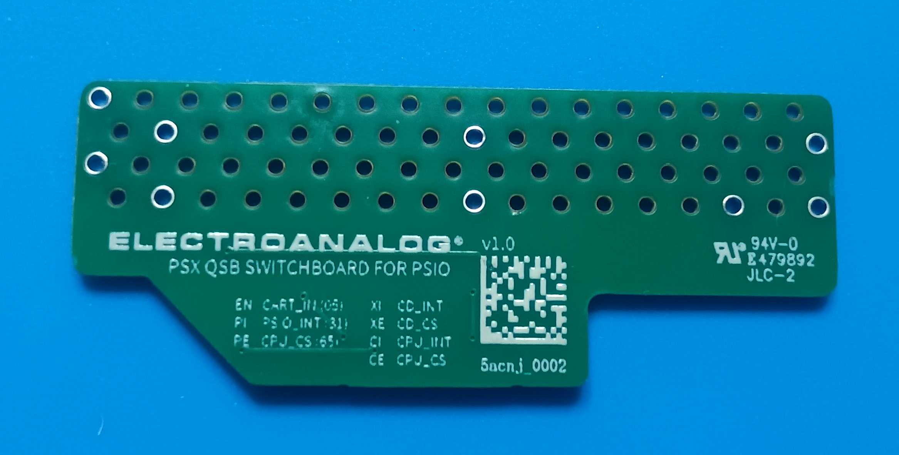

# PSX SIO-qsb

  

---

## Table of Contents

- [Pinout](#pinout)
- [Installation Notes](#installation-notes)
- [Gallery](#gallery)  

---

## Overview

**PSX SIO-qsb** is a compact Quick Solder Board (QSB) for the original PlayStation (PS1) that offers an alternative installation method to the official PSIO Switch Board and compatible third-party variants.  
It provides a cleaner and more streamlined installation layout while maintaining full compatibility with PSIO cartridges.  
Designed for minimal footprint and tidy routing, the QSB can be fabricated using standard **FR-4** PCBs (1 mm or thinner) or **Flex PCBs** for ultra-low profile integration.

By reducing the number of routed signals compared to the standard Switch Board, this board reduces installation complexity without compromising PSIO functionality.  

---

## Pinout

| PSIO Signal | PSX SIO-qsb pads |
|-------------|------------------|
| XE          | XE               |
| XI          | XI               |
| CE          | CE               |
| CI          | CI               |

Only four signals require soldered wire connections to the mainboard.  
The remaining necessary lines **VCC**, **GND (VSS)**, **EN**, **PI**, and **PE** are internally sourced via direct physical alignment between the **PSX SIO-qsb** and the through-hole solder points of the **CN103 Parallel I/O port**, located on the underside of the PlayStation mainboard.

---

## Installation Notes

- Recommended PCB material:  
  - **FR-4 Standard**, thickness ≤ 1.0 mm  or **Flex PCB**  
- Connections should be soldered directly designed points previously prepared.  
- Fine-pitch soldering skills and proper tools are strongly recommended.  
- The console CD-ROM bay is ready when PSIO is disconnected, as with the official Switch Board design.  

> ℹ️ Installation points differs depending on PS1 motherboard revision. Always reference an installation diagram for your console’s PU-xx board code.

---

## Gallery

*PSX SIO-qsb installed over CN103 on PU-8 mainboard*  
  

*Front view of PSX SIO-qsb*  

*Back view of PSX SIO-qsb*  

---

## License

This project is licensed under the **CERN Open Hardware Licence Version 2 – Strongly Reciprocal (CERN-OHL-S v2)**.  
You may copy, modify, and distribute the design files, but any modified versions must also be licensed under the same terms.

For full license text, see the [LICENSE](LICENSE) file or visit the [CERN-OHL-S v2 official page](https://gitlab.com/ohwr/project/cernohl/-/wikis/Documents/CERN-OHL-version-2).

---

## Credits

Created by **Electroanalog (2025)**  
Compatible with both genuine and third-party PSIO cartridges.  

---

## Topics / Tags

`psx` `playstation` `psio` `switchboard` `qsb` `modchip` `hardware` `retro` `flexpcb` `gerber`
