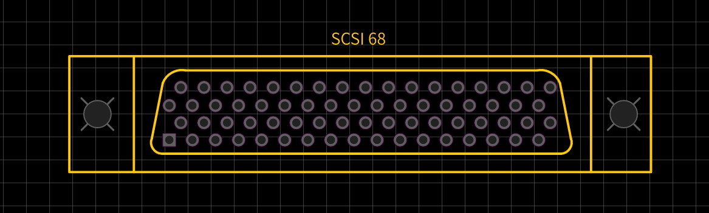
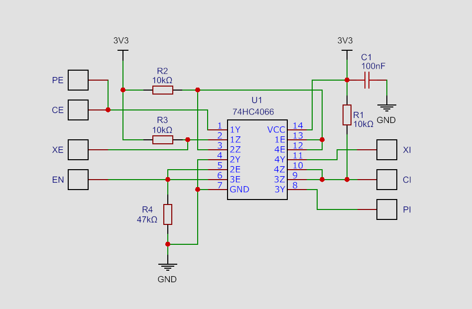

# PSX SIO-qsb

  

**PSX SIO-qsb** is a quick solder board (QSB) developed specifically for use with the **PSIO*** optical drive emulator for the original PlayStation (PS1).  

The typical PSIO installation requires a standard Switch Board with nine wires soldered to specific points on the mainboard, along with some trace modifications.  
As a more practical alternative, **PSX SIO-qsb** connects directly to the parallel interface on the underside, reducing the wiring to only **four** connections.
It features the most compact footprint and a cleaner layout, enabling a more efficient and discreet installation.  

\* _**PSIO** is a flash cartridge that allows games to be loaded directly from an SD card via the console’s rear Parallel I/O port, bypassing the optical drive entirely._

---

## Table of Contents

- [Pinout](#pinout)
- [Installation Notes](#installation-notes)
- [Bill of Materials (BOM)](#bill-of-materials-bom)
- [Adapter Layout](#adapter-layout)
- [Schematic](#schematic)
- [Gallery](#gallery)
- [Why is it called PSX SIO-qsb?](#why-is-it-called-psx-sio-qsb)

---

## Overview

**PSX SIO-qsb** is a Quick Solder Board (QSB) developed as an alternative to the standard PSIO Switch Board, offering a simplified installation process with a more streamlined and purposeful layout.  
It maintains full compatibility with PSIO cartridges while focusing on clear routing and practical integration.  
Designed for reduced board area and tidy wiring, the QSB can be fabricated using standard **FR-4** PCBs (1 mm or thinner) or **Flex PCBs** for ultra-low profile installation.  

By reducing the number of external wires compared to the standard Switch Board, this board simplifies installation without compromising PSIO functionality.  

---

## Pinout

| Signal | Function       | Routed to Mainboard | Pin(s) on Connector | Description                 |
|--------|----------------|---------------------|---------------------|-----------------------------|
| **XI** | CD_INT         | Yes                 | Wired               | Interrupt from CD-ROM       |
| **XE** | CD_CS          | Yes                 | Wired               | Chip Select for CD-ROM      |
| **CI** | CPU_INT        | Yes                 | Wired               | Interrupt to CPU            |
| **CE** | CPU_CS         | Yes                 | Wired               | Chip Select to CPU          |
| EN     | CART_IN        | No                  | 05                  | Slot-detected cartridge in  |
| PI     | PSIO_INT       | No                  | 31                  | PSIO interrupt signal       |
| PE     | CPU_CS         | No                  | 65                  | Shared with CE              |
| VDD    | +3.3V          | No                  | 17, 51              | Supplied from CN103         |
| VSS    | GND            | No                  | 1, 34, 35, 68       | Ground via CN103            |  

> [!NOTE]
> - The four primary signal lines **XI**, **XE**, **CI**, **CE** must be manually wired from their corresponding pads on the **PSX SIO-qsb** to specific solder points on the PS1 mainboard.  
> - The remaining lines **VCC**, **VSS**, **EN**, **PI**, and **PE** are soldered directly to the through-hole pins of the **CN103** (Parallel I/O port), located on the underside of the PS1 mainboard. Their corresponding pads on the **PSX SIO-qsb** are designed to align precisely with these pins for direct soldering to the exposed pin leads.

---

## Installation Notes

- **Preparation of the console’s mainboard and proper installation of the switchboard are strictly required for PSIO operation.**  
- Connections should be soldered directly to the designated points previously prepared on the mainboard.
- The recommended wire for these connections is **30 AWG wire-wrap**, which offers the ideal flexibility and diameter for clean routing.  
- Fine-pitch soldering skills and proper tools are strongly recommended.  
- The console’s CD-ROM bay remains fully functional when the PSIO cartridge is disconnected, as with the standard Switch Board design.  
- Installing the **PSX SIO-qsb** does not interfere with the normal operation of the CD-ROM drive when the PSIO cartridge is not inserted.  
- When using the PSIO menu system, users may launch disc-based games directly from the CD-ROM drive or access the built-in CD Player without removing the PSIO cartridge.

> [!IMPORTANT]
> Installation points differs depending on PS1 motherboard revision. Always reference an installation diagram for your console’s PU-xx board code.

> [!CAUTION]
> Never insert the PSIO cartridge into a console that has not been modified with the switchboard, as doing so may result in damage to both the PSIO and the console’s mainboard.

---

## Bill of Materials (BOM)

| Reference  | Value     | Package    | Description                                      |
|------------|-----------|------------|--------------------------------------------------|
| R1, R2, R3 | 10k       | 0603 SMD   | Thick Film Resistor                              |
| R4         | 47k       | 0603 SMD   | Thick Film Resistor                              |
| C1         | 100nF     | 0603 SMD   | Multilayer Ceramic Capacitor (MLCC)              |
| U1         | 74HC4066  | TSSOP-14   | Quad SPST Analog Switch (Nexperia or compatible) |  

---

## Adapter Layout

A ready-to-manufacture Gerber file for the PSX SIO-qsb is included in this repository and can be downloaded from the [Releases](https://github.com/Electroanalog/PSX-SIO-qsb/releases) section:

- [**PSX SIO-qsb**](https://github.com/Electroanalog/PSX-SIO-qsb/releases/download/v1.1/Gerber_PSX-SIO-qsb.zip): Manufacturing-ready layout for a low-profile add-on under the CN103 interface

> [!TIP]
> Recommended PCB material: **FR-4 Standard** (thickness ≤ 1.0 mm) or **Flex PCB**, to fit beneath the mainboard.

---

## Schematic

The **PSX SIO-qsb** was developed based on the original Switch Board schematic published by *Cybdyn Systems*, available at [GamingDocs](https://gamingdoc.org/modding/consoles/sony-playstation/ode/psio/information/switchboard).  
Its physical layout was designed from scratch using the mechanical footprint of a **68-pin SCSI connector** as a baseline for proper alignment and integration under the PS1 mainboard.  

---

## Gallery

*PSX SIO-qsb installed over CN103 pins on PU-8 mainboard*  

*Front view of PSX SIO-qsb*  

*Back view of PSX SIO-qsb*  

---

## Why is it called PSX SIO-qsb?

**PSX SIO-qsb** may be considered a utilitarian name, as *"qsb"* clearly identifies both the form factor and function of the board.  
In this case, it refers to a compact switchboard that facilitates signal routing between the PSIO and the console’s CD-ROM interface, all while preserving the simplicity of quick soldering.  
The designation defines its role clearly as an essential bridge for PSIO operation, engineered to streamline installation with minimal overhead.  
Yes, that’s the point. Let the name speak for itself.  

---

## PSX SIO-qsb is also available on OSHWLab

  

---

## License

This project is licensed under the **CERN Open Hardware Licence Version 2 – Strongly Reciprocal (CERN-OHL-S v2)**.  
You may copy, modify, and distribute the design files, but any modified versions must also be licensed under the same terms.

For full license text, see the [LICENSE](LICENSE) file or visit the [CERN-OHL-S v2 official page](https://gitlab.com/ohwr/project/cernohl/-/wikis/Documents/CERN-OHL-version-2).

---

## Credits

Created by **Electroanalog® VICE (2025)**  
Compatible with genuine and third-party PSIO cartridges.  

*PlayStation is a registered trademark of Sony Interactive Entertainment LLC (SIE), formerly Sony Computer Entertainment Inc. (SCE). All rights reserved.*  

---

## Topics / Tags

`psx` `playstation` `ps1` `psio` `switchboard` `qsb` `modchip` `retrogaming` 
