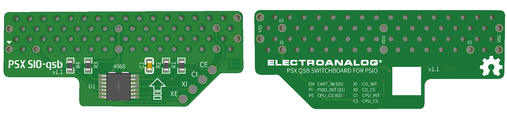
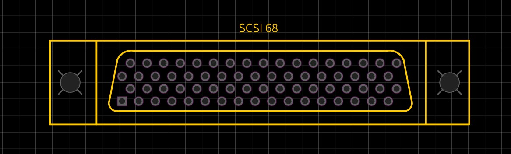
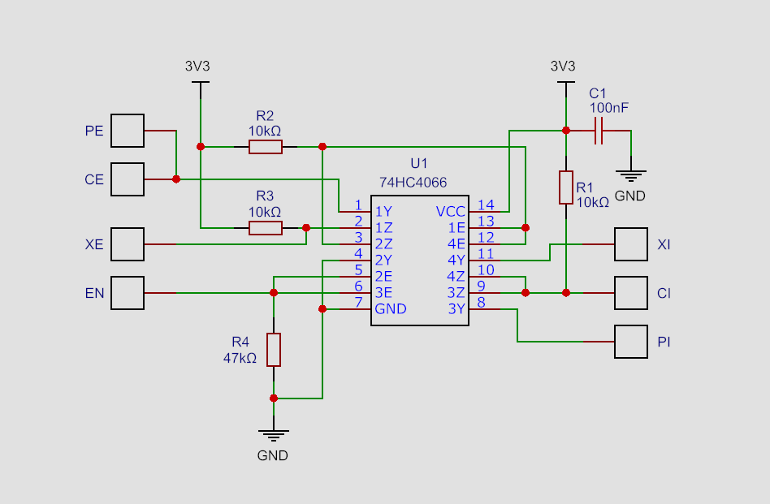
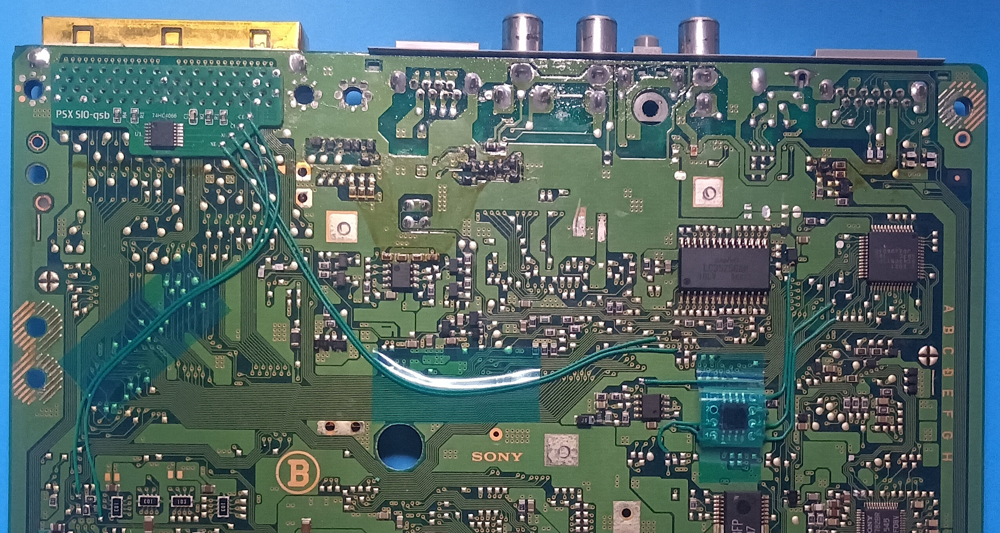
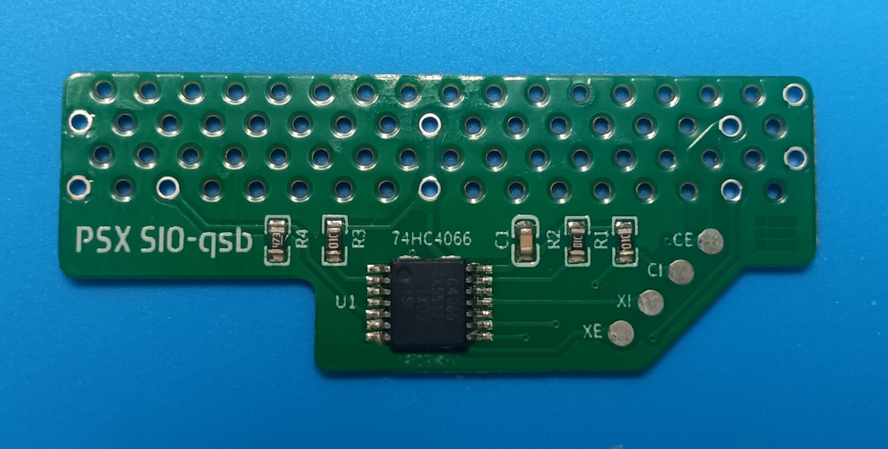
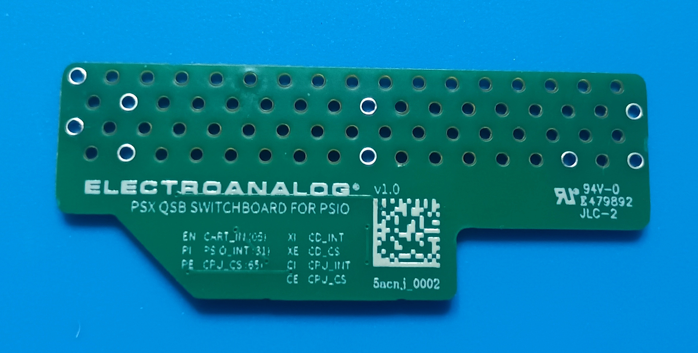

# PSX SIO-qsb

  

Unlike the standard Switch Board, which relies on nine individual wires, **PSX SIO-qsb** integrates directly with the parallel interface on the underside of the original PlayStation (PS1) mainboard, reducing the connection count to only **four** wires.  
It features the most compact footprint and a cleaner layout compared to other existing solutions, offering a more efficient and discreet installation.

---

## Table of Contents

- [Pinout](#pinout)
- [Installation Notes](#installation-notes)
- [Bill of Materials (BOM)](#bill-of-materials-bom)
- [Schematic](#schematic)
- [Gallery](#gallery)
- [Why is it called PSX SIO-qsb?](#why-is-it-called-psx-sio-qsb)

---

## Overview

**PSX SIO-qsb** is a smaller and more streamlined Quick Solder Board (QSB) for the original PlayStation (PS1) that serves as an alternative to the standard PSIO Switch Board, offering a simplified installation process compared to other available solutions.  
It provides a cleaner and more streamlined installation layout while maintaining full compatibility with PSIO cartridges.  
Designed for minimal footprint and tidy routing, the QSB can be fabricated using standard **FR-4** PCBs (1 mm or thinner) or **Flex PCBs** for ultra-low profile integration.  

By reducing the number of external wires compared to the standard Switch Board, this board simplifies installation without compromising PSIO functionality.  

---

## Pinout

| Signal | Function       | Routed to Mainboard | Pin(s) on Connector | Description                 |
|--------|----------------|---------------------|---------------------|-----------------------------|
| **XI** | CD_INT         | Yes                 | Wired               | Interrupt from CD-ROM       |
| **XE** | CD_CS          | Yes                 | Wired               | Chip Select for CD-ROM      |
| **CI** | CPU_INT        | Yes                 | Wired               | Interrupt to CPU            |
| **CE** | CPU_CS         | Yes                 | Wired               | Chip Select to CPU          |
| EN     | CART_IN        | No                  | 05                  | Slot-detected cartridge in  |
| PI     | PSIO_INT       | No                  | 31                  | PSIO interrupt signal       |
| PE     | CPU_CS         | No                  | 65                  | Shared with CE              |
| VDD    | +3.3V          | No                  | 17, 51              | Supplied from CN103         |
| VSS    | GND            | No                  | 1, 34, 35, 68       | Ground via CN103            |  

> [!NOTE]
> The four primary signal lines **XI**, **XE**, **CI**, **CE** must be manually wired from their corresponding pads on the **PSX SIO-qsb** to specific solder points on the PS1 mainboard.  
> The recommended wire for these connections is 30 AWG wire-wrap, which offers the ideal flexibility and diameter for clean routing.  
> The remaining lines **VCC**, **VSS**, **EN**, **PI**, and **PE** are soldered directly to the through-hole pins of the **CN103** (Parallel I/O port), located on the underside of the PS1 mainboard. Their corresponding pads on the **PSX SIO-qsb** are designed to align precisely with these pins for direct soldering to the exposed pin leads.

---

## Installation Notes

- Recommended PCB material:  
  - **FR-4 Standard**, thickness ≤ 1.0 mm, or **Flex PCB**  
- Connections should be soldered directly to the designated points previously prepared on the mainboard.  
- Fine-pitch soldering skills and proper tools are strongly recommended.  
- The console’s CD-ROM bay remains fully functional when the PSIO cartridge is disconnected, as with the standard Switch Board design.  
- Installing the **PSX SIO-qsb** does not interfere with the normal operation of the CD-ROM drive when the PSIO cartridge is not inserted.  
- When using the PSIO menu system, users may launch disc-based games directly from the CD-ROM drive or access the built-in CD Player without removing the PSIO cartridge.  

> ℹ️ Installation points differs depending on PS1 motherboard revision. Always reference an installation diagram for your console’s PU-xx board code.

---

## Bill of Materials (BOM)

| Reference  | Value     | Package    | Description                                      |
|------------|-----------|------------|--------------------------------------------------|
| R1, R2, R3 | 10k       | 0603 SMD   | Thick Film Resistor                              |
| R4         | 47k       | 0603 SMD   | Thick Film Resistor                              |
| C1         | 100nF     | 0603 SMD   | Multilayer Ceramic Capacitor (MLCC)              |
| U1         | 74HC4066  | TSSOP-14   | Quad SPST Analog Switch (Nexperia or compatible) |  

---

## Schematic

The **PSX SIO-qsb** was developed based on the original Switch Board schematic published by *Cybdyn Systems*, available at [GamingDocs](https://gamingdoc.org/modding/consoles/sony-playstation/ode/psio/information/switchboard).  
Its physical layout was designed from scratch using the mechanical footprint of a **68-pin SCSI connector** as a baseline for proper alignment and integration under the PS1 mainboard.  

---

## Gallery

*PSX SIO-qsb installed over CN103 pins on PU-8 mainboard*  

*Front view of PSX SIO-qsb*  

*Back view of PSX SIO-qsb*  

---

## Why is it called PSX SIO-qsb?  

One might say that calling it the **"PSX SIO-qsb"** sounds too utilitarian.  
We'd argue: *That's precisely the point!*  
The designation clearly defines the board’s purpose as a *Quick Solder Board* for PSIO, engineered to streamline installation with minimal overhead.  
You don’t need a name that leaves you guessing when **qsb** already says what it is, and what it’s for.

---

## License

This project is licensed under the **CERN Open Hardware Licence Version 2 – Strongly Reciprocal (CERN-OHL-S v2)**.  
You may copy, modify, and distribute the design files, but any modified versions must also be licensed under the same terms.

For full license text, see the [LICENSE](LICENSE) file or visit the [CERN-OHL-S v2 official page](https://gitlab.com/ohwr/project/cernohl/-/wikis/Documents/CERN-OHL-version-2).

---

## Credits

Created by **Electroanalog (2025)**  
Compatible with genuine and third-party PSIO cartridges.  

*PlayStation is a registered trademark of Sony Interactive Entertainment LLC (SIE), formerly Sony Computer Entertainment Inc. (SCE). All rights reserved.*  

---

## Topics / Tags

`psx` `playstation` `ps1` `psio` `switchboard` `qsb` `modchip` `retrogaming` 
